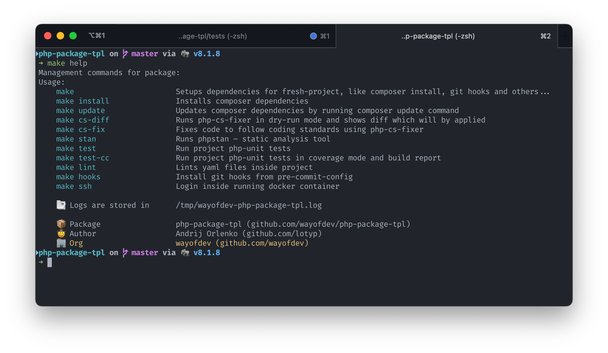

<br>

<div align="center">


</div>


<br>

<br>

<div align="center">
<a href="https://github.com/wayofdev/laravel-webhook-client/actions"></a>
<a href="https://packagist.org/packages/wayofdev/laravel-webhook-client"></a>
<a href="https://packagist.org/packages/wayofdev/laravel-webhook-client"></a>
<a href="https://packagist.org/packages/wayofdev/laravel-webhook-client"></a>
<a href="https://packagist.org/packages/wayofdev/laravel-webhook-client"></a>
</div>

<br>

# Laravel Package Template

This is minimal Laravel template which is used by other PHP projects in wayofdev organization.

If you **like/use** this package, please consider **starring** it. Thanks!



## 💿 Installation

### → Using composer

Require as dependency:

```bash
$ composer req wayofdev/laravel-webhook-client
```

<br>

## 🧪 Running Tests

### → PHPUnit tests

To run tests, run the following command:

```bash
$ make test
```

### → Static Analysis

Code quality using PHPStan:

```bash
$ make stan
```

### → Coding Standards Fixing

Fix code using The PHP Coding Standards Fixer (PHP CS Fixer) to follow our standards:

```bash
$ make cs-fix
```

<br>

## 🤝 License

[](./LICENSE)

<br>

## 🙆🏼‍♂️ Author Information

Created in **2022** by [lotyp / wayofdev](https://github.com/wayofdev)

<br>
